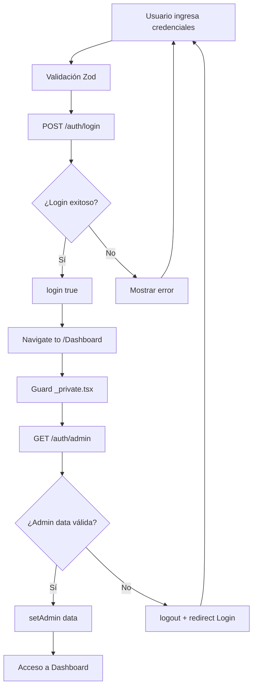

# URGARA Jornales App

Aplicación React para el sistema URGARA de gestión de jornales.

## Tech Stack

- **React 19** con TypeScript
- **Vite** para build tooling
- **TanStack Router** con file-based routing
- **TanStack Query** para server state management
- **Zustand** para client state management
- **Mantine UI** components
- **Axios** para HTTP requests
- **Biome** para linting y formatting

## Comandos de Desarrollo

```bash
npm run dev          # Servidor de desarrollo
npm run build        # Build de producción
npm run lint         # Verificar código con Biome
npm run lint:fix     # Auto-fix de linting
npm run format:write # Formatear código
npm run check:fix    # Ejecutar todas las verificaciones y fixes
npm run preview      # Preview del build de producción
```

## Interceptor de Notificaciones

La aplicación incluye un interceptor de respuestas de Axios que maneja automáticamente las notificaciones de error y éxito.

### Ubicación
`src/interceptors/error-response-interceptor.ts`

### Funcionalidad

- **Notificaciones automáticas**: Muestra notificaciones para todos los errores de API
- **Mensajes personalizables**: Permite override de mensajes por endpoint específico
- **Logout automático**: Maneja errores de autenticación y redirige al login
- **Fallback inteligente**: Usa mensajes por defecto si no se especifican personalizados

### Uso Básico

```typescript
// Petición normal - usa mensajes por defecto
const response = await DYNNAMIX_API.get('/users');
```

### Uso con Mensajes Personalizados

#### Formato Simple (Solo mensaje)
```typescript
// Personalizar solo el mensaje de error
const response = await DYNNAMIX_API.get('/users', {
  customNotifications: {
    [ErrorType.VALIDATION_ERROR]: 'Credenciales inválidas. Verifique DNI y contraseña',
    [ErrorType.NOT_FOUND]: 'Usuario no encontrado en el sistema',
    [ErrorType.UNAUTHORIZED]: 'Credenciales incorrectas'
  }
});
```

#### Formato Completo (Configuración avanzada)
```typescript
// Control total sobre la notificación
const response = await DYNNAMIX_API.post('/users', userData, {
  customNotifications: {
    [ErrorType.VALIDATION_ERROR]: {
      title: 'Error de Validación',
      message: 'Los datos ingresados no son válidos',
      autoClose: 5000
    },
    [ErrorType.CONFLICT]: 'El DNI ya está registrado' // Formato simple mezclado
  }
});
```

### Configuración TypeScript

El tipado está definido en `src/models/declarations.type.ts`:

```typescript
import type { NotificationData } from '@mantine/notifications';
import type { ErrorType } from './generic-responses.type';

declare module 'axios' {
  interface AxiosRequestConfig {
    customNotifications?: Partial<
      Record<ErrorType, string | Partial<Omit<NotificationData, 'color'>>>
    >;
  }
}
```

### Mensajes por Defecto

Los mensajes por defecto están definidos en `src/utils/list-message-errors-response.ts`. El interceptor fusiona inteligentemente las configuraciones:

```typescript
// Para strings: solo actualiza el mensaje
notifications[key] = {
  ...notifications[key],
  message: customValue
};

// Para objetos: merge completo
notifications[key] = {
  ...notifications[key],
  ...customValue
};
```

### Manejo de Errores de Autenticación

El interceptor maneja automáticamente los errores de autenticación:

- `ErrorType.TOKEN_EXPIRED`: Token expirado
- `ErrorType.SECURITY_ALERT`: Alerta de seguridad

Cuando ocurren estos errores:
1. Se ejecuta logout automático
2. Se redirige al usuario a `/Login` después de 1.5 segundos
3. Se muestra la notificación correspondiente

### Estructura de Notificaciones

Las notificaciones se muestran con:
- **Título**: "Error"
- **Mensaje**: Personalizado o por defecto
- **Color**: Rojo para errores
- **Posición**: Configurada globalmente en Mantine

### Ejemplo Completo

```typescript
import { DYNNAMIX_API } from '@/config';
import { ErrorType } from '@/models';

export const userService = {
  getUsers: () => DYNNAMIX_API.get('/users', {
    customNotifications: {
      [ErrorType.NOT_FOUND]: 'No hay usuarios registrados',
      [ErrorType.NETWORK]: 'Error de conexión al servidor'
    }
  }),

  createUser: (userData: CreateUserData) => DYNNAMIX_API.post('/users', userData, {
    customNotifications: {
      [ErrorType.VALIDATION]: 'Verifique los datos del usuario',
      [ErrorType.CONFLICT]: 'El DNI ya está registrado'
    }
  })
};
```

## QueryCache Error Handling

Complementando el interceptor de Axios, la aplicación también maneja errores no-API usando QueryCache y MutationCache de TanStack Query.

### Ubicación
`src/config/query.config.ts`

### Funcionalidad

- **Errores de validación Zod**: Notificaciones naranjas con detalles del campo específico
- **Errores de sistema**: Errores de red, código, etc. (no relacionados con API)
- **Diferenciación inteligente**: Solo maneja errores que no tienen `error.response`

### Tipos de Errores Manejados

#### 1. Validaciones Zod (Cambios del Backend)
```typescript
// Si el backend cambia la estructura de respuesta
const validatedResponse = LoginResponseSchema.parse(response.data);
// → Console: Detalles técnicos para developers
// → Usuario: "Los datos del servidor no tienen el formato esperado"
```

#### 2. Errores de Sistema (Red, Código, etc.)
```typescript
// NetworkError, TypeError, etc.
// → Console: Stack trace completo
// → Usuario: "Error interno de la aplicación web"
```

### Sistema Dual de Manejo de Errores

| Tipo de Error | Manejado Por | Color | Usuario Ve | Developer Ve |
|---------------|--------------|-------|-----------|--------------|
| **HTTP/API** | Interceptor | 🔴 Rojo | Mensaje personalizable | Response completo |
| **Validación Zod** | QueryCache | 🟠 Naranja | "Formato no esperado" | Path + issues detallados |
| **Sistema/Red** | QueryCache | 🔴 Rojo | "Error interno" | Stack trace + context |

### División de Responsabilidades

#### Queries
- **Zod errors** son comunes por cambios del backend
- QueryCache maneja parsing de respuestas
- Útil para detectar breaking changes en API

#### Mutations
- **Zod errors** son raros (validación previa en formularios)
- Si ocurren, indica error interno de la aplicación
- Formularios previenen datos inválidos

### Configuración Actualizada

```typescript
function showNotifications(error: Error, context?: { service: string; key?: unknown }) {
  if (error instanceof ZodError) {
    console.error('Validation Error:', {
      service: context?.service,
      key: context?.key,
      error: error.message,
      issues: error.issues,
    });
    notifications.show({
      title: 'Error de Validación de Datos',
      message: 'Los datos recibidos del servidor no tienen el formato esperado. Por favor contacte a los desarrolladores.',
      color: 'orange',
    });
  } else if (!('response' in error)) {
    console.error('System Error:', {
      service: context?.service,
      key: context?.key,
      error: error.message,
      stack: error.stack,
    });
    notifications.show({
      title: 'Error Interno de la aplicacion web',
      message: 'Vuelva a intentarlo mas tarde o contacte a los desarrolladores.',
      color: 'red',
    });
  }
}

const QUERY = new QueryClient({
  queryCache: new QueryCache({
    onError: (error, query) => {
      showNotifications(error, {
        service: 'Query',
        key: query.queryKey
      });
    },
  }),
  mutationCache: new MutationCache({
    onError: (error) => {
      showNotifications(error, {
        service: 'Mutation'
      });
    },
  }),
});
```

### Ventajas

- **Cobertura completa**: Interceptor + QueryCache = todos los errores cubiertos
- **Diferenciación visual**: Colores diferentes para tipos de error
- **No duplicación**: Lógica inteligente previene notificaciones duplicadas
- **Consistencia**: Mismo estilo de notificaciones en toda la app

## Sistema de Autenticación

La aplicación implementa un sistema de autenticación dual con verificación tanto del estado de login como de la validez de los datos del usuario.

### Flujo de Autenticación

#### 1. Proceso de Login

```typescript
// Endpoint: POST /auth/login
// Request body: { dni: string, password: string }
```

**Pasos del login:**

1. **Validación de datos**: Se valida DNI y contraseña con Zod
2. **Llamada a API**: `POST /auth/login` con credenciales
3. **Respuesta exitosa**: API retorna confirmación de autenticación
4. **Actualización de estado**: Se marca `isAuth: true` en Zustand
5. **Redirección**: Navigate automático a `/Dashboard`

#### 2. Verificación de Admin

```typescript
// Endpoint: GET /auth/admin
// Response: { data: Admin, success: boolean }
```

**Guard de rutas privadas:**

1. **Primera verificación**: ¿Usuario autenticado? (`context.isAuth`)
2. **Segunda verificación**: Fetch de datos del admin via `/auth/admin`
3. **Validación de datos**: Verificar que `adminData.data` existe
4. **Carga en context**: `setAdmin(adminData.data)` en el store
5. **Auto-logout**: Si falla cualquier paso → logout + redirect a Login

### Arquitectura del Sistema

#### Estado de Autenticación (Zustand)

```typescript
interface AuthState {
  isAuth: boolean;        // Estado de autenticación (persistido)
  admin: Admin | null;    // Datos del usuario (no persistido)
  login: (isAuth: boolean) => void;
  setAdmin: (data: Admin) => void;
  logout: () => void;
}
```

**Persistencia:**
- **Persistido**: Solo `isAuth` en localStorage
- **No persistido**: Datos del admin (se refresca en cada sesión)

#### Endpoints de Autenticación

| Endpoint | Método | Propósito | Respuesta |
|----------|--------|-----------|-----------|
| `/auth/login` | POST | Autenticar usuario | `{ success: boolean }` |
| `/auth/admin` | GET | Obtener datos del admin | `{ data: Admin, success: boolean }` |

#### Guards y Redirecciones

```typescript
// Root guard (__root.tsx)
beforeLoad: ({ context }) => {
  if (!context.isAuth) {
    throw redirect({ to: '/Login' });
  }
}

// Private guard (_private.tsx)
beforeLoad: async ({ context }) => {
  // 1. Verificar autenticación
  if (!context.isAuth) {
    throw redirect({ to: '/Login' });
  }

  // 2. Verificar datos del admin
  try {
    const adminData = await QUERY.ensureQueryData(adminQueryOptions);
    if (!adminData?.data) {
      useAuthStore.getState().logout();
      throw redirect({ to: '/Login' });
    }
    useAuthStore.getState().setAdmin(adminData.data);
  } catch {
    useAuthStore.getState().logout();
    throw redirect({ to: '/Login' });
  }
}
```

### Manejo de Errores de Autenticación

#### En el Interceptor
```typescript
// Auto-logout para errores de autenticación
if (errorData.name === ErrorType.TOKEN_EXPIRED ||
    errorData.name === ErrorType.SECURITY_ALERT) {
  useAuthStore.getState().logout();
  setTimeout(() => {
    router.navigate({ to: '/Login' });
  }, 1500);
}
```

#### Códigos de Error Comunes
- **UNAUTHORIZED**: Credenciales incorrectas
- **TOKEN_EXPIRED**: Sesión expirada
- **SECURITY_ALERT**: Problema de seguridad
- **NOT_FOUND**: Usuario no encontrado

### Flujo Completo de Autenticación



### Características del Sistema

- **Doble verificación**: Login + validación de datos del admin
- **Auto-logout**: Sesiones inválidas se cierran automáticamente
- **Persistencia inteligente**: Solo el estado de auth, no datos sensibles
- **Cache de admin**: 5 minutos de stale time para optimizar requests
- **Error handling**: Interceptor maneja errores de auth globalmente
- **Guards anidados**: Verificación en múltiples niveles de routing

